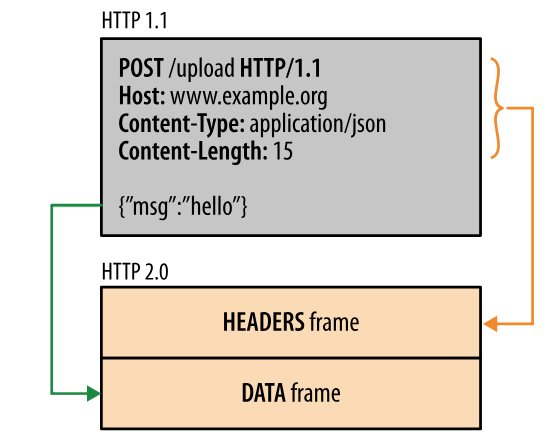

# HTTP
***
### 基础概念
#### 请求和响应报文
请求报文结构：
* 第一行包含了请求方法、URL、协议版本
* 接下来多行都是请求头，每个首部都有一个首部名称，以及对应的值
* 一个空行用来分隔头和体
* 最后是请求的请求体
```
GET http://www.example.com/ HTTP/1.1
Accept: text/html,application/xhtml+xml,application/xml;q=0.9,image/webp,image/apng,*/*;q=0.8,application/signed-exchange;v=b3;q=0.9
Accept-Encoding: gzip, deflate
Accept-Language: zh-CN,zh;q=0.9,en;q=0.8
Cache-Control: max-age=0
Host: www.example.com
If-Modified-Since: Thu, 17 Oct 2019 07:18:26 GMT
If-None-Match: "3147526947+gzip"
Proxy-Connection: keep-alive
Upgrade-Insecure-Requests: 1
User-Agent: Mozilla/5.0 xxx

param1=1&param2=2
```
响应报文结构：
* 第一行包含协议版本、状态码以及描述，eg. 200 OK表示请求成功了
* 接下来多行也是头部内容
* 一个空行分隔头和体
* 最后是响应的响应体
```
HTTP/1.1 200 OK
Age: 529651
Cache-Control: max-age=604800
Connection: keep-alive
Content-Encoding: gzip
Content-Length: 648
Content-Type: text/html; charset=UTF-8
Date: Mon, 02 Nov 2020 17:53:39 GMT
Etag: "3147526947+ident+gzip"
Expires: Mon, 09 Nov 2020 17:53:39 GMT
Keep-Alive: timeout=4
Last-Modified: Thu, 17 Oct 2019 07:18:26 GMT
Proxy-Connection: keep-alive
Server: ECS (sjc/16DF)
Vary: Accept-Encoding
X-Cache: HIT

<!doctype html>
<html>
<head>
    <title>Example Domain</title>
	// 省略... 
</body>
</html>
```
#### URL
URL = URI + URN
***
### HTTP方法
#### HEAD方法
获取报文首部
与GET方法类似，但是不返回报文实体的主体部分
主要用于确认URL的有效性以及资源更新的日期时间等

#### OPTIONS方法
查询指定URL能够支持的方法
会返回 Allow: GET, POST, HEAD, OPTIONS 这样的内容

#### CONNECT方法
要求在与代理服务器通信时建立隧道
使用SSL和TLS协议把通讯内容加密后经网络隧道传输
CONNECT www.example.com:443 HTTP/1.1

#### TRACE方法
服务器会将通信路径返回给客户端
发送请求时，在 Max-Forwards 首部字段中填入数值，每经过一个服务器就会减 1，当数值为 0 时就停止传输。
通常不会使用 TRACE，并且它容易受到 XST 攻击（Cross-Site Tracing，跨站追踪）。
***

### 链接管理
#### 1.短链接和长链接
长链接只需要建立一次链接就能进行多次HTTP通讯
* 从HTTP/1.1 开始默认是长链接的，如果要断开链接，需要由客户端或者服务端提出断开，使用 Connection:close
* 在HTTP/1.1 之前默认是短链接的，如果要使用长链接，则使用 Connection: Keep-Alive
  
#### 2.流水线
默认情况下，HTTP 请求是按顺序发出的，下一个请求只有在当前请求收到响应才会发出。于受到网络延迟和带宽的限制，在下一个请求被发送到服务器之前，可能需要等待很长时间。

流水线是在同一条长连接上连续发出请求，而不用等待响应返回，这样可以减少延迟。

#### 3.Cookie
新的浏览器 API 已经允许开发者直接将数据存储到本地，如使用 Web storage API（本地存储和会话存储）或 IndexedDB。
***
### HTTP2.0
#### HTTP/1.x 缺陷
HTTP/1.x 实现简单是以牺牲性能为代价的：

* 客户端需要使用多个连接才能实现并发和缩短延迟；
* 不会压缩请求和响应首部，从而导致不必要的网络流量；
* 不支持有效的资源优先级，致使底层 TCP 连接的利用率低下。

#### 二进制分层帧
HTTP/2.0 将报文分成 HEADERS 帧和 DATA 帧，他们都是二进制格式的

在通信过程中，只会有一个TCP链接存在，它承载了任意数量的双向数据流（Stream）
* 一个数据流都有一个唯一标识符和可选的优先级信息，用于承载双向消息
* 消息是与逻辑请求或响应对应的完整的一系列帧
* 帧是最小的通信单位，来自不同数据流的帧可以交错发送，然后再根据每个帧头的数据流标识符重新组装

#### 服务端推送
HTTP/2.0 在客户端请求一个资源时，会把相关的资源一起发送给客户端，客户端就不需要再次发送请求了

#### 首部压缩
HTTP/1.1 的首部带有大量信息，而且每次都要重复发送
HTTP/2.0 要求客户端和服务端同时维护和更新一个包含之前见过的首部字段表，从而避免了重复传输
不仅如此，HTTP/2.0 也是用 Huffman 编码对首部字段进行压缩

### HTTP2.0多路复用和HTTP1.x长链接区别
HTTP/1.x 一次请求-响应，建立一个链接，用完关闭；每次请求都要新建一个链接

HTTP/1.1 默认长链接，同一个域名访问多个文件复用同一个链接，若干个请求排队串行化单线程处理，后面的请求等待前面请求的返回才能获得执行机会，一旦有某请求超时，后续请求超时只能被阻塞，也就是线头阻塞。而且访问多个不同的文件依然会建立多个请求

HTTP/2.0 多个请求可以同时在一个链接上并行，某个请求阻塞不会影响其他的请求正常执行